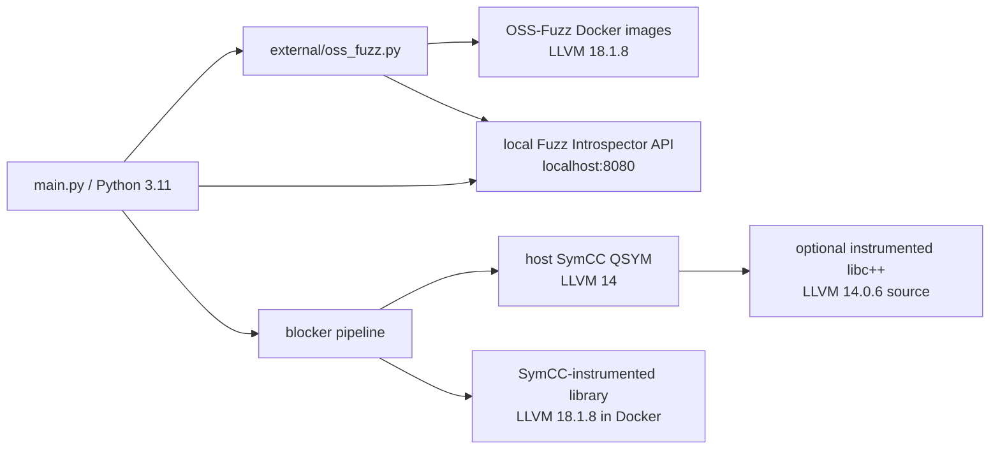

# LLM-FuzzGen

以 LLM 產生與改善 OSS-Fuzz fuzz target，並整合 Fuzz Introspector、coverage、crash analysis 與 SymCC blocker solver。



## 已確認的版本基準

以下版本是在 2026-08-16 依目前工作目錄與 Docker daemon 實際盤點的結果。OSS-Fuzz 沒有一般套件式的 release version，因此以 upstream Git commit 表示。

| 元件 | 版本 / commit | 用途與來源 |
| --- | --- | --- |
| LLM-FuzzGen | `e5cabffe7962163c13adb096a9af877ed6f3b4b4`（盤點基準） | `cpu-budget-scheduler` branch；安裝時應使用包含本 README 的最新 branch commit |
| Host OS | Ubuntu 22.04 x86_64 | 目前腳本與路徑以此環境為準 |
| Host Python | Python 3.11.x；目前 `.venv` 是 3.11.13 | 主程式與 local Introspector API |
| Docker Engine | 目前 client/server 28.4.0 | 不是嚴格版本限制；需支援一般 Linux bind mount 與 BuildKit |
| OSS-Fuzz snapshot | [`9f58c388aa52b9641260211a546ceb42b23f9fcf`](https://github.com/google/oss-fuzz/commit/9f58c388aa52b9641260211a546ceb42b23f9fcf) | `external/oss-fuzz/` 是此 upstream snapshot 加上本專案修改，不是 submodule；修改差異可參考 `external/patches/oss-fuzz.patch` |
| Fuzz Introspector | package `0.1.10`；[`8944d0b001754f60a602c95a816880f885f1e38d`](https://github.com/ossf/fuzz-introspector/commit/8944d0b001754f60a602c95a816880f885f1e38d) | `external/fuzz-introspector/` 與 OSS-Fuzz `base-clang` 都固定此 commit；本地修改見 `external/patches/fuzz-introspector.patch` |
| OSS-Fuzz LLVM | `llvmorg-18.1.8` | `base-clang/checkout_build_install_llvm.sh` 固定版本，負責 fuzzing、coverage 與 Introspector build |
| SymCC | `v1.0-158-g3b8acab`；[`3b8acabf06c83b92facccde7f6dfb191b1a163b3`](https://github.com/eurecom-s3/symcc/commit/3b8acabf06c83b92facccde7f6dfb191b1a163b3) | `symcc/` 必須另外 clone，目前不在主 repo 追蹤內 |
| SymCC runtime | [`892f817f38f5abfa083dd0c1caa7ced821566bf5`](https://github.com/eurecom-s3/symcc-rt/commit/892f817f38f5abfa083dd0c1caa7ced821566bf5) | SymCC 的 `runtime` submodule；一定要執行 recursive submodule init |
| Host LLVM / Clang | Ubuntu LLVM/Clang 14.0.0 | `symcc/build` 的 QSYM backend 與一般 blocker harness |
| LLVM 14 source | `llvmorg-14.0.6`；`f28c006a5895fc0e329fe15fead81e37457cb1d1` | `llvm-project-14/`；blocker 需要其 `FuzzedDataProvider.h`，STL 模式也用它建 instrumented libc++ |
| Standalone SymCC image | Ubuntu 22.04、LLVM 15、Rust 1.94.0、AFL 2.56b | 由 `symcc/Dockerfile` 定義；它方便獨立測試，但主 blocker pipeline 不直接使用這個 image |

SymCC 在這個專案有三個 build，不能互相覆蓋：

| 路徑 | LLVM | Backend | 實際用途 |
| --- | --- | --- | --- |
| `symcc/build` | 14 | QSYM | 主機執行 blocker harness 與 concolic exploration |
| `symcc/build_simple` | 14 | simple | 建置 instrumented libc++；只有 STL symbolic tracing 需要 |
| `symcc/build_llvm18` | 18.1.8 | simple | 掛進 OSS-Fuzz builder container，把 target library 本身編成 SymCC instrumented archive |

### Docker image 基準

`setup.sh` 的 non-Taiwan 路徑固定以下兩個可從 GCR 取得的 image，再由 repo 內 Dockerfile 建 `base-builder`、`base-builder-ruby` 與 `base-runner`：

| Image | 固定 digest |
| --- | --- |
| `gcr.io/oss-fuzz-base/base-image` | `sha256:a1fd7287efaefa39df54216edaa7b732d33eb54c06155fa9ebc7dbdc2e1d9286` |
| `gcr.io/oss-fuzz-base/base-clang` | `sha256:fd173151d9281639f85eff98e998a1601189bc93665b6d9a18a2ecbe24682d76` |

目前工作機器的 `latest` tags 是 `base-image@770c5b04...`、`base-clang@5edfe989...`、`base-builder@616913fd...`、`base-builder-ruby@991744fe...`、`base-runner@f4825d6a...`。前兩個 digest 還能從 GCR 取得，但後三個是 local build，registry 沒有對應 manifest，因此它們只能作為診斷紀錄，不能當作他人安裝來源。可重建的基準是上表兩個 digest 加上 repo 內 Dockerfile。

## 主機需求

- Ubuntu 22.04 x86_64。ARM 沒有走過完整的 SymCC / LLVM 18 blocker 驗證。
- 建議至少 16 GB RAM、8 CPU cores、120 GB 可用空間。目前單是 `external/oss-fuzz/build` 約 41 GB，Docker images 與 build cache 約 50 GB。
- Docker daemon 必須可由目前使用者執行，不能只安裝 client。
- 安裝與第一次 build 需要連線到 GitHub、GCR、Ubuntu mirror、Google Storage，以及各 target 的 source repository。
- LLM backend 需要對應帳號與 credential；詳見後面的「LLM 與環境變數」。

## 從乾淨 Ubuntu 22.04 還原

### 1. Clone 主專案

`external/oss-fuzz/` 與 `external/fuzz-introspector/` 已直接收進主 repo，不要再用最新版 upstream 覆蓋它們。

```bash
git clone --branch cpu-budget-scheduler \
  https://github.com/pei-lun-chien/LLM_FuzzGen_Seed.git LLM-FuzzGen
cd LLM-FuzzGen
```

### 2. 安裝主機工具

```bash
sudo apt update
sudo apt install -y \
  software-properties-common ca-certificates curl wget gnupg lsb-release \
  git build-essential cmake ninja-build pkg-config \
  clang-14 llvm-14 llvm-14-dev llvm-14-tools \
  libz3-dev zlib1g-dev libxml2-dev \
  cargo gdb rsync zstd zip unzip

sudo add-apt-repository -y ppa:deadsnakes/ppa
sudo apt update
sudo apt install -y python3.11 python3.11-venv python3.11-dev
```

Docker Engine 請使用 Docker 官方 Ubuntu repository，不要只安裝可能落後的 `docker.io`：

```bash
sudo install -m 0755 -d /etc/apt/keyrings
sudo curl -fsSL https://download.docker.com/linux/ubuntu/gpg \
  -o /etc/apt/keyrings/docker.asc
sudo chmod a+r /etc/apt/keyrings/docker.asc

echo \
  "deb [arch=$(dpkg --print-architecture) signed-by=/etc/apt/keyrings/docker.asc] https://download.docker.com/linux/ubuntu $(. /etc/os-release && echo "$VERSION_CODENAME") stable" \
  | sudo tee /etc/apt/sources.list.d/docker.list >/dev/null

sudo apt update
sudo apt install -y \
  docker-ce docker-ce-cli containerd.io docker-buildx-plugin docker-compose-plugin
sudo usermod -aG docker "$USER"
```

重新登入 shell，或執行 `newgrp docker`，再確認 daemon 權限：

```bash
docker version
docker run --rm hello-world
```

### 3. 建 Python 3.11 環境與 OSS-Fuzz images

```bash
python3.11 -m venv .venv
source .venv/bin/activate
python --version
./setup.sh
```

`setup.sh` 會安裝：

- `requirements.txt` 的主程式依賴。
- Fuzz Introspector local web API 依賴。
- repo 內 `external/fuzz-introspector/src` 的 editable package。
- OSS-Fuzz base images。

腳本詢問 Taiwan apt repository 時，輸入 `n` 會使用上面列出的固定 base image digest，這是一般環境的建議還原路徑；輸入 `y` 會從 repo 內 Dockerfile 全部重建，且 `base-image` 會改用 `free.nchc.org.tw` mirror。完整重建 LLVM 與 base images 會花很久，也會使用數十 GB 空間。

測試與 SymCC 的 `ninja check` 另需：

```bash
python -m pip install pytest==9.0.3 lit==18.1.8
python -m pip check
```

### 4. 安裝固定版本 SymCC

fresh clone 不包含 `symcc/`；請固定 commit 並初始化 runtime submodule：

```bash
git clone https://github.com/eurecom-s3/symcc.git symcc
git -C symcc checkout 3b8acabf06c83b92facccde7f6dfb191b1a163b3
git -C symcc submodule update --init --recursive

test "$(git -C symcc rev-parse HEAD)" = \
  "3b8acabf06c83b92facccde7f6dfb191b1a163b3"
test "$(git -C symcc/runtime rev-parse HEAD)" = \
  "892f817f38f5abfa083dd0c1caa7ced821566bf5"
```

建立主機使用的 LLVM 14 + QSYM build：

```bash
cmake -S symcc -B symcc/build -G Ninja \
  -DCMAKE_BUILD_TYPE=RelWithDebInfo \
  -DSYMCC_RT_BACKEND=qsym \
  -DZ3_TRUST_SYSTEM_VERSION=on \
  -DLLVM_DIR=/usr/lib/llvm-14/cmake
ninja -C symcc/build
ninja -C symcc/build check
```

`symcc/build/symcc` 與 `symcc/build/sym++` 是 blocker pipeline 的預設路徑。

### 5. 安裝 LLVM 14 source 與 LLVM 18.1.8 tools

LLVM 14 source 對 blocker mode 是必要項目，不只是 STL 的選配項目：

```bash
git clone --depth 1 --branch llvmorg-14.0.6 \
  https://github.com/llvm/llvm-project.git llvm-project-14
test "$(git -C llvm-project-14 rev-parse HEAD)" = \
  "f28c006a5895fc0e329fe15fead81e37457cb1d1"
```

blocker coverage replay 預設從 `$HOME/tools/llvm-18.1.8/bin` 找 `llvm-cov` 與 `llvm-profdata`。安裝官方 LLVM 18.1.8 binary release：

```bash
LLVM18_NAME='clang+llvm-18.1.8-x86_64-linux-gnu-ubuntu-18.04'
LLVM18_ARCHIVE="/tmp/${LLVM18_NAME}.tar.xz"
curl -L \
  "https://github.com/llvm/llvm-project/releases/download/llvmorg-18.1.8/${LLVM18_NAME}.tar.xz" \
  -o "$LLVM18_ARCHIVE"
mkdir -p "$HOME/tools"
tar -xJf "$LLVM18_ARCHIVE" -C "$HOME/tools"
mv "$HOME/tools/$LLVM18_NAME" "$HOME/tools/llvm-18.1.8"

"$HOME/tools/llvm-18.1.8/bin/llvm-cov" --version
"$HOME/tools/llvm-18.1.8/bin/llvm-profdata" --version
```

接著建立給 OSS-Fuzz container 使用的 LLVM 18 simple-backend SymCC。`CLANG_BINARY` 故意設成 container 內的 `/usr/local/bin/clang`；這份 wrapper 不應拿來當 host compiler：

```bash
LLVM18_ROOT="$HOME/tools/llvm-18.1.8"
cmake -S symcc -B symcc/build_llvm18 -G Ninja \
  -DCMAKE_BUILD_TYPE=Release \
  -DSYMCC_RT_BACKEND=simple \
  -DZ3_TRUST_SYSTEM_VERSION=on \
  -DLLVM_DIR="$LLVM18_ROOT/lib/cmake/llvm" \
  -DCMAKE_C_COMPILER="$LLVM18_ROOT/bin/clang" \
  -DCMAKE_CXX_COMPILER="$LLVM18_ROOT/bin/clang++" \
  -DCLANG_BINARY=/usr/local/bin/clang \
  -DCLANGPP_BINARY=/usr/local/bin/clang++
ninja -C symcc/build_llvm18
```

`symcc_library` build 會先在 project container 內安裝 `libz3-4`。只有 container 無法 apt install 時，才需要提供 fallback：

```bash
mkdir -p symcc/lib
cp -L /lib/x86_64-linux-gnu/libz3.so.4 symcc/lib/libz3.so.4
```

### 6. 選配：STL symbolic tracing

只有 branch 條件經過 `std::string`、`std::vector`、`std::map` 或 `std::unordered_map` 內部邏輯時才需要 instrumented libc++。前面工具裝妥後執行：

```bash
ROOT_DIR="$PWD" ./scripts/setup_symcc_stl.sh
```

這會建立 `symcc/build_simple`、`libcxx_symcc_build` 與 `libcxx_symcc_install`，並覆寫既有的後兩個目錄。完整原理與單獨驗證方式見 [`docs/setup_symcc_stl.md`](docs/setup_symcc_stl.md)；一般 SymCC 說明見 [`docs/setup_symcc.md`](docs/setup_symcc.md)。

### 7. LLM 與環境變數

CLI 預設 backend 是 Vertex AI。`process`、`run_all_fuzzer` 與 `run_blocker_once` 都會初始化 LLM client；只有 `replay_corpus_crashes` 不需要 LLM credential。

Vertex AI：

```bash
# 只在使用預設 Vertex AI backend 時安裝 Google Cloud CLI。
sudo install -m 0755 -d /usr/share/keyrings
curl -fsSL https://packages.cloud.google.com/apt/doc/apt-key.gpg \
  | sudo gpg --dearmor --yes -o /usr/share/keyrings/cloud.google.gpg
echo "deb [signed-by=/usr/share/keyrings/cloud.google.gpg] https://packages.cloud.google.com/apt cloud-sdk main" \
  | sudo tee /etc/apt/sources.list.d/google-cloud-sdk.list >/dev/null
sudo apt update
sudo apt install -y google-cloud-cli

gcloud init
gcloud auth application-default login
export VERTEXAI_PROJECT_ID='YOUR_GCP_PROJECT_ID'
export VERTEXAI_LOCATION='us-central1'
```

CI 或遠端機器也可改設 `GOOGLE_APPLICATION_CREDENTIALS` 指向有 Vertex AI 權限的 service-account JSON，不必執行互動式登入；credential 檔不可 commit。

Gemini API、OpenRouter 或 Ollama 擇一使用時：

```bash
export GOOGLE_API_KEY='YOUR_GOOGLE_API_KEY'       # --llm gemini
export OPENROUTER_API_KEY='YOUR_OPENROUTER_KEY'   # --llm openrouter
# --llm ollama 需要 localhost:11434 已啟動，並先 pull config/config.yaml 指定的 model。
```

LangSmith tracing 是選配：

```bash
export LANGSMITH_TRACING=true
export LANGSMITH_API_KEY='YOUR_LANGSMITH_API_KEY'
```

model、token budget、coverage iteration 與 blocker iteration 都在 [`config/config.yaml`](config/config.yaml) 設定。不要把 API key 寫進該檔或 commit 到 repo。

GDB call-chain 工具若遇到 `ptrace: Operation not permitted`，可暫時調整：

```bash
sudo sysctl -w kernel.yama.ptrace_scope=0
```

這會降低同機程序間的 ptrace 限制，只在需要 GDB 時使用；完成後可改回 `1`。

## 安裝驗證

先做不需長時間 fuzzing 的基本檢查：

```bash
source .venv/bin/activate
python --version
python -m pip check
python -c 'import yaml, requests, langchain, langgraph, fuzz_introspector'
python main.py --help

docker info >/dev/null
docker image inspect \
  gcr.io/oss-fuzz-base/base-image:latest \
  gcr.io/oss-fuzz-base/base-clang:latest \
  gcr.io/oss-fuzz-base/base-builder:latest \
  gcr.io/oss-fuzz-base/base-builder-ruby:latest \
  gcr.io/oss-fuzz-base/base-runner:latest >/dev/null

test -x symcc/build/symcc
test -x symcc/build/sym++
test -x symcc/build_llvm18/symcc
test -f symcc/build_llvm18/libsymcc.so
test -f llvm-project-14/compiler-rt/include/fuzzer/FuzzedDataProvider.h
```

執行 unit tests：

```bash
python -m pytest -q unitest
```

執行一個最小 OSS-Fuzz build；這一步會下載 target source：

```bash
python external/oss-fuzz/infra/helper.py build_image cjson
python external/oss-fuzz/infra/helper.py build_fuzzers cjson
```

驗證 SymCC 三種 project build flavor：

```bash
./scripts/test_symcc_builds.sh \
  --projects 'cjson' \
  --flavor all
```

完整 Fuzz Introspector report smoke test：

```bash
python external/oss-fuzz/infra/helper.py introspector cjson --seconds 30 --clean
```

## 執行方式
啟用 blocker pipeline：

```bash
python3 main.py run_all_fuzzer cjson \
  --budget-mode fuzzing-cpu \
  --run-fuzzers 86400 \
  --coverage-interval 3600 \
  --fuzz-targets-parallel 4 \
  --print-coverage \
  --use-blocker \
  --coverage-stagnation-window 1 \
  --coverage-stagnation-threshold 0.05 \
  --target-exposure-min-seconds 30 \
  --generated-target-priority-seconds 300 \
  --blocker-session-size 5 \
  --blocker-top-k 10 \
  --blocker-max-iterations 2 \
  --blocker-fuzz-seconds 15 \
  --blocker-artifact-report-seconds 30 \
  --blocker-refresh-branch-growth-threshold 0.05 \
  --blocker-refresh-branch-growth-floor 50 \
  --llm vertexai \
  --model gemini-2.5-pro
```


每次執行的 log、coverage、blocker 與 crash artifacts 會寫入 `experiments/<timestamp>_<command-or-project>/`。OSS-Fuzz build/corpus 在 `external/oss-fuzz/build/`，兩者都會快速占用大量空間。

## Project Dockerfile 版本狀態

目前主 repo 內直接提供 11 個 project definition。主要實驗 targets 的 source pin 如下：

| Project | Source pin |
| --- | --- |
| `c-ares` | tag/branch `cares-1_20_0` |
| `cjson` | `12c4bf1986c288950a3d06da757109a6aa1ece38` |
| `lcms` | `04ace9c100fc6850f09223dd6c7ad8fa634acd06` |
| `libpcap` | `2559282f3db683e03cd29d30ab5947d6e14a6500` |
| `libtiff` | `fcd4c86c4907d859c3124c8ad786868ba3f0b713` |
| `libvpx` | `9514ab684d3680e5180404894809328611179ad1` |
| `tinyxml2` | `8224e427b655b83dae5e2298f1e6919523a78737` |
| `tomlplusplus` | `1e8829b793b66ad17011732a146b8077d379b011` |
| `zlib` | `5a82f71ed1dfc0bec044d9702463dbdf84ea3b71` |

=========

blocker 的 `symcc_library` 已設定並驗證的 allowlist 是：`libpcap`、`libvpx`、`cjson`、`tinyxml2`、`lcms`、`zlib`、`libtiff`；`tomlplusplus` 是 header-only，不產生獨立 library archive。

## 常見還原問題

- `setup.sh` 顯示 Python 不是 3.11：先 `source .venv/bin/activate`，再執行腳本；Ubuntu 22.04 系統預設 `python3` 通常是 3.10。
- Docker 出現 socket permission denied：重新登入讓 `docker` group 生效，並用 `docker info` 驗證。
- `llvm-cov` 找不到：確認 `$HOME/tools/llvm-18.1.8/bin/llvm-cov` 存在；blocker scripts 預設使用這個固定路徑。
- `FuzzedDataProvider.h` 找不到：`llvm-project-14` 尚未 clone，或不是 `llvmorg-14.0.6`。
- `symcc_library` 找不到 `/usr/local/bin/clang`：`symcc/build_llvm18` 的 wrapper 建錯用途；重跑 LLVM 18 CMake command，保留 `-DCLANG_BINARY=/usr/local/bin/clang`。
- Introspector API 連不上：確認 port 8080 沒被占用；程式會由 `external/introspector.py` 啟動 local web API。
- Docker build 因 Taiwan mirror 連線失敗：重新執行 `setup.sh` 並選 `n`。
- 不要全域 export `SYMCC_LIBCXX_PATH`；只在確定需要 instrumented libc++ 的單一 command 設定，避免污染一般 C++ build。

更多 blocker 元件責任與流程見 [`docs/integration_blocker_system.md`](docs/integration_blocker_system.md)。
